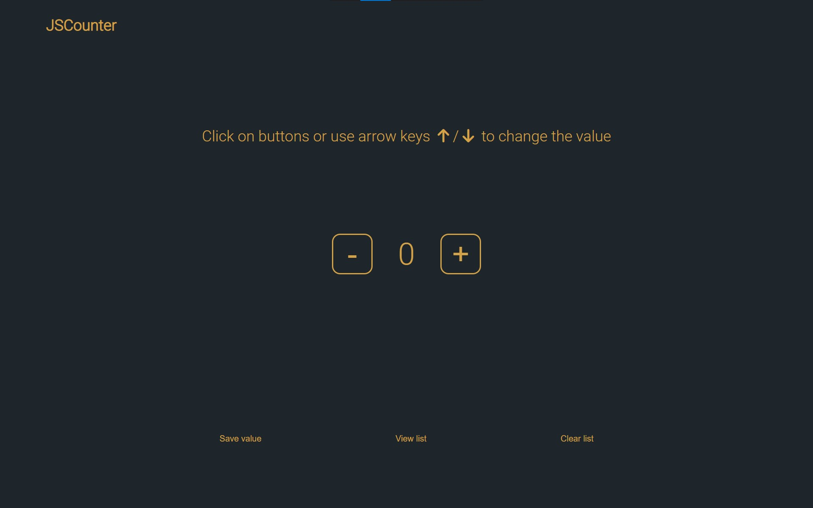

<!-- PROJECT LOGO -->
 

  

  <h3 align="center">Javascript Counter</h3>

  

    A simple counter powered by javascript!
     
    <a href="https://github.com/alisherkhan98/Javascript-counter"><strong>Explore the docs »</strong></a>
     
     
    <a href="https://alisherkhan98.github.io/Javascript-counter/">View Demo</a>
    ·
    <a href="https://github.com/alisherkhan98/Javascript-counter/issues">Report Bug</a>
    ·
    <a href="https://github.com/alisherkhan98/Javascript-counter/issues">Request Feature</a>
  

<!-- ABOUT THE PROJECT -->
## About The Project

As you can see from the screenshot above you have a counter with initial value equal to 0 and to buttons to change that value.

There are also three additional buttons below:

* save: to save the current value of the counter
* view list: to see a list of all saved values and the time they were saved at
* clear list: to delete all saved values

Be careful: you can only save up to 10 values.

 

(<a href="#top">back to top</a>)

<!-- Installation -->
## Installation and setup
You don't need any installation or setup, just run the app and use it!

 

(<a href="#top">back to top</a>)

<!-- Usage -->
## Usage
As for the usage, you can use the app literally whenever you need to count something and save some values, and you will have the time too! 

## Contributing

1. Fork it (<https://github.com/alisherkhan98/Javascript-counter/fork>)
2. Create your feature branch (`git checkout -b feature/fooBar`)
3. Commit your changes (`git commit -am 'Add some fooBar'`)
4. Push to the branch (`git push origin feature/fooBar`)
5. Create a new Pull Request

 

(<a href="#top">back to top</a>)

## Contact me
Here's the link to my LinkedIn <https://www.linkedin.com/in/ali-sher-khan-1331a8205>

 

(<a href="#top">back to top</a>)

